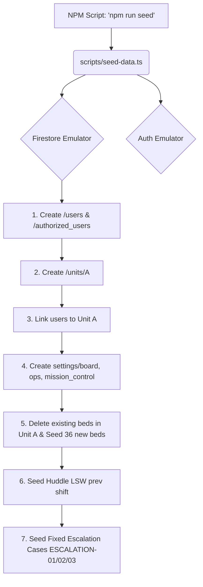

# Audit Seeds: Dependency Graph

## Diagrama de Execução Principal (E2E / Emulador Local)

A estrutura atual de seeds não possui interdependências complexas ou uma árvore de chamadas. Existe um fluxo linear centralizado no script canônico.

## Análise de Dependências

1. **Inexistência de Seeds Direcionados ou Paralelos**: Não há múltiplos seeds como `seed-users`, `seed-beds`, `seed-lean` que são compostos. O arquivo `seed-data.ts` é monolítico e insere todos os domínios de uma vez.
2. **Setup Global Requerido**: Para rodar qualquer teste E2E (Kamishibai, Mission Control, Kanban, etc.), a suíte de testes não injeta os dados de que precisa. Ela pressupõe que `npm run seed` foi executado antes de levantar o ambiente.
3. **Isolamento de Testes Unitários/Integração (Backend)**:
   As funções em `functions/src/__tests__/analytics/*.test.ts` implementam seus próprios micro-seeds simulando o que a trigger do Firestore faria (`seedReset`, `seedUpdateClear`). Estes não tocam no emulador E2E global nem interferem na interface principal. O seu escopo morre ao final de seus respectivos cenários (utilizam UUIDs únicos/randomizados in-memory e deletam o app mockado).
