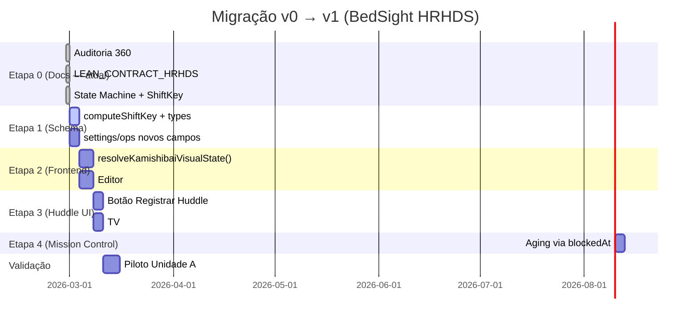

# LEAN\_MIGRATION\_MAP\_v0\_to\_v1 — BedSight

**Versão:** v1.0 | **Data:** 2026-02-28 | **Base:** LEAN\_CONTRACT\_HRHDS v1.0 + LEAN\_STATE\_MACHINE\_HRHDS v1.0 + LEAN\_SHIFTKEY\_SPEC\_HRHDS v1.0

---

## 1. Objetivo da migração

| Objetivo | Por quê |
| ---------- | --------- |
| Remover ambiguidade do estado `'na'` | `'na'` cobre leito vazio + domínio N/A + não-revisado — semanticamente inválido (auditoria: `AUDIT_Kamishibai_States` §6, Gap G1) |
| Manter compatibilidade retroativa | Dados antigos não devem quebrar a UI durante e após a migração |
| Permitir migração incremental por unidade | Unidade A pode estar em v1 enquanto futuras unidades aguardam |
| Adicionar suporte a TTL de turno (verde expira) | Núcleo do contrato Lean — `reviewedShiftKey` novo campo |
| Adicionar `blockedAt` dedicado | Remove dependência de `updatedAt` como proxy de aging |

---

## 2. Mapeamento de estado v0 → v1

### 2.1 Tabela de tradução

Use esta tabela no render-time (frontend) para mapear dados Firestore v0 para estado visual v1:

| Condição v0 (em ordem de precedência) | Estado visual v1 |
| --------------------------------------- | ----------------- |
| `bed.patientAlias.trim() === ''` | **INACTIVE** |
| `kamishibaiEnabled === false` (campo novo ausente → tratar como `true`) | **INACTIVE** |
| `entry === undefined` (kamishibai não tem o domínio) | **NOT\_APPLICABLE** |
| `entry.status === 'na'` E `bed.patientAlias.trim() === ''` | **INACTIVE** |
| `entry.status === 'na'` E domínio ∉ `applicableDomains` (OD-2) | **NOT\_APPLICABLE** |
| `entry.status === 'na'` (caso restante — legado ambíguo) | **UNREVIEWED\_THIS\_SHIFT** |
| `entry.status === 'blocked'` | **BLOCKED** |
| `entry.status === 'ok'` E `reviewedShiftKey` ausente | **UNREVIEWED\_THIS\_SHIFT** |
| `entry.status === 'ok'` E `reviewedShiftKey ≠ currentShiftKey` | **UNREVIEWED\_THIS\_SHIFT** |
| `entry.status === 'ok'` E `reviewedShiftKey === currentShiftKey` | **OK** (verde válido) |

> **Regra de ouro para o `na` legado:** na dúvida, tratar como `UNREVIEWED_THIS_SHIFT` (sem cor). É conservador: mostra "não revisado" em vez de verde falso. Isso é *preferível* a mostrar um estado incorreto.

### 2.2 Exemplos de documentos v0 e seu estado visual v1

#### Caso A — leito vazio com `na` em todos os domínios (legado)

```json
{ "patientAlias": "", "kamishibai": { "medical": { "status": "na" }, ... } }
```

→ Todos os domínios: **INACTIVE** (leito vazio — regra 1 dispara)

#### Caso B — leito ativo, domínio com `ok` mas sem `reviewedShiftKey`

```json
{ "patientAlias": "JC", "kamishibai": { "medical": { "status": "ok" } } }
```

→ `medical`: **UNREVIEWED\_THIS\_SHIFT** (verde legado não é válido sem carimbo de turno)

#### Caso C — leito ativo, domínio com `na` (legado ambíguo)

```json
{ "patientAlias": "JC", "kamishibai": { "physio": { "status": "na" } } }
```

→ `physio`: **UNREVIEWED\_THIS\_SHIFT** (tratamento conservador — physio pode ser aplicável)

*Se OD-2 estiver resolvido (Variante A), verificar primeiro `applicableDomains`:*

- `physio ∉ applicableDomains` → **NOT\_APPLICABLE**
- `physio ∈ applicableDomains` → **UNREVIEWED\_THIS\_SHIFT**

#### Caso D — leito ativo, domínio com `blocked` sem `blockedAt` (legado)

```json
{ "patientAlias": "MA", "kamishibai": { "nursing": { "status": "blocked", "updatedAt": "2026-02-27T14:00:00Z" } } }
```

→ `nursing`: **BLOCKED** (regra 4 — blocked persist entre turnos)
→ Aging calculado por proxy: `(now - updatedAt) / 3600000` (comportamento v0 mantido temporariamente)

#### Caso E — leito ativo após migração v1 (doc com `reviewedShiftKey`)

```json
{ "patientAlias": "RB", "kamishibai": { "medical": { "status": "ok", "reviewedShiftKey": "2026-02-28-AM" } } }
```

→ Se `currentShiftKey === "2026-02-28-AM"`: **OK** (verde válido)
→ Se `currentShiftKey === "2026-02-28-PM"`: **UNREVIEWED\_THIS\_SHIFT** (verde expirou)

---

## 3. Duas variantes para representar N/A (OD-2)

> **Status:** Decisão aberta pendente ratificação do dono do produto. As duas variantes são especificadas abaixo sem escolha automática.

---

### Variante A — `applicableDomains[]` explícito (recomendada)

**Schema novo em `Bed`:**

```typescript
applicableDomains: SpecialtyKey[]; // domínios que SE APLICAM ao paciente deste leito
// Ausência do campo → todos os domínios são aplicáveis (backward compat)
```

**Regra de N/A:**

```text
domain ∉ bed.applicableDomains → NOT_APPLICABLE
```

**Vantagens:**

- Explícito e verificável — sem ambiguidade
- Query-ável: `WHERE 'physio' NOT IN applicableDomains`
- Compatibilidade: ausência do campo = todos aplicáveis (sem migração obrigatória de docs)

**Desvantagens:**

- Novo campo a escrever no Editor
- Aumenta tamanho do documento

**Migração de dados:** campo `applicableDomains` é opcional. Docs sem o campo → todos os domínios são considerados aplicáveis.

---

### Variante B — omissão de domínio no mapa Kamishibai (minimalista)

**Schema atual `Bed`:**

```typescript
kamishibai: Record<SpecialtyKey, KamishibaiEntry>; // se domínio ausente → NOT_APPLICABLE
```

**Regra de N/A:**

```text
!bed.kamishibai?.[domain] → NOT_APPLICABLE
```

**Vantagens:**

- Sem novo campo de schema
- Menor documento Firestore
- Sem custo de escrita adicional

**Desvantagens:**

- **Risco alto:** o frontend atual usa `entry?.status || 'na'` como fallback — entry ausente hoje vira `'na'`, não `NOT_APPLICABLE`. Toda lógica de render precisa mudar.
- Não distinguível de "documento corrompido / não migrado"
- Mais difícil de inspecionar no Console Firestore
- Query-abilidade complexa (não tem `NOT IN map-key` nativo no Firestore)

---

### Comparação das variantes

| Critério | Variante A | Variante B |
| ---------- | ----------- | ----------- |
| Explicitude | ✅ Alta | ❌ Implícita |
| Compatibilidade retroativa | ✅ Ausência = todos aplicáveis | ❌ Requer mudança de fallback no render |
| Tamanho do documento | 🟡 Leve aumento | ✅ Menor |
| Query-abilidade | ✅ Direto | ❌ Difícil |
| Risco de migração | 🟢 Baixo | 🔴 Alto (mudar fallback de render) |

---

## 4. Compatibilidade temporária (v1 convivendo com v0)

### 4.1 Regras de fallback

| Campo novo (v1) | Ausente no doc v0 | Comportamento de fallback | Duração |
| ----------------- | ------------------- | -------------------------- | --------- |
| `reviewedShiftKey` | Não existe | Tratar como `UNREVIEWED_THIS_SHIFT` (verde não válido) | Até migração total |
| `blockedAt` | Não existe | Usar `updatedAt` como proxy de aging com `⚠️` em docs | Até migração total |
| `kamishibaiEnabled` | Não existe em `settings/ops` | Tratar como `true` (habilitado por padrão) | Até migração total |
| `applicableDomains` | Não existe | Todos os domínios são aplicáveis | Permanente (Variante A) |
| `lastHuddleShiftKey` | Não existe em `settings/ops` | Tratar como huddle nunca registrado (`HUDDLE_PENDING`) | Até migração total |

### 4.2 Garantia de não-regressão

Nenhuma das regras de fallback pode resultar em um estado mais favorável (verde) do que o correto. Em qualquer ambiguidade, o estado mais conservador (sem cor ou vermelho) é aplicado.

```text
Princípio de segurança: errar para o lado do "alerta", nunca para o lado do "tudo ok"
```

---

## 5. Checklist de migração por unidade

> Este checklist é **manual** — nenhuma etapa executa código de migração automática. Cada unidade percorre o checklist quando decidir aderir ao v1.

### Pré-requisitos

- [ ] `LEAN_CONTRACT_HRHDS.md` ratificado pelo dono do produto
- [ ] OD-1 (horários de turno) decidida: AM=`____:____` PM=`____:____`
- [ ] OD-2 (como representar N/A) decidida: Variante [ ] A ou [ ] B
- [ ] OD-3 (quem pode registrar huddle) decidida
- [ ] OD-4 (campo `note` obrigatório?) decidida
- [ ] OD-5 (aging/escalonamento v1) decidida

### Schema — `settings/ops`

- [ ] Campo `kamishibaiEnabled: boolean` adicionado (default `true`)
- [ ] Campo `huddleSchedule: { amStart: string, pmStart: string }` adicionado (default `"07:00"/"19:00"`)
- [ ] Campos `lastHuddleAt`, `lastHuddleType`, `lastHuddleShiftKey`, `lastHuddleRegisteredBy` adicionados

### Schema — `beds/{bedId}.kamishibai.{domain}`

- [ ] Campo `reviewedShiftKey: string` adicionado aos novos writes (não retroativo)
- [ ] Campo `reviewedAt: Timestamp` adicionado aos novos writes
- [ ] Campo `blockedAt: Timestamp` adicionado nos novos SET_BLOCKED (não retroativo)
- [ ] Campo `resolvedAt: Timestamp` adicionado nos RESOLVE_BLOCKED (não retroativo)
- [ ] Se OD-2 = Variante A: campo `applicableDomains: SpecialtyKey[]` adicionado ao documento `bed`

### Seed/Emulador

- [ ] `scripts/seed-data.ts` atualizado para incluir `reviewedShiftKey`, `blockedAt`, `applicableDomains` (se Variante A)
- [ ] `settings/ops` no seed inclui `kamishibaiEnabled`, `huddleSchedule`
- [ ] Seed validado com `npm run seed` e UI verificada no emulador

### Frontend — render

- [ ] `KamishibaiScreen.tsx` usa `resolveKamishibaiVisualState()` em vez de `entry?.status || 'na'`
- [ ] Lógica de render distingue `INACTIVE`, `NOT_APPLICABLE`, `UNREVIEWED_THIS_SHIFT`, `OK`, `BLOCKED`
- [ ] `computeShiftKey()` implementada em `src/domain/shiftKey.ts`
- [ ] Fallback v0 (sem `reviewedShiftKey`) retorna `UNREVIEWED_THIS_SHIFT`

### Frontend — Editor

- [ ] `SET_OK` grava `reviewedShiftKey` e `reviewedAt`
- [ ] `SET_BLOCKED` grava `blockedAt` (somente se novo bloqueio), `reviewedShiftKey`, `reviewedAt`
- [ ] `RESOLVE_BLOCKED` grava `resolvedAt` e atualiza status para `ok`
- [ ] Se OD-2 = Variante A: UI de `applicableDomains` implementada

### Huddle

- [ ] Botão "Registrar Huddle AM/PM" implementado (TV ou Admin)
- [ ] Grava `lastHuddleAt`, `lastHuddleType`, `lastHuddleShiftKey`, `lastHuddleRegisteredBy`
- [ ] TV exibe indicador "Huddle pendente" quando `lastHuddleShiftKey ≠ currentShiftKey`

### Mission Control

- [ ] Aging de bloqueador usa `blockedAt` quando disponível, `updatedAt` como fallback (com log de warning)
- [ ] Contagem `kamishibaiImpedimentBedsCount` exclui leitos com `kamishibaiEnabled = false`

### Validação — Unidade A (piloto)

- [ ] Verde expira corretamente ao simular virada de turno (mudar hora local / `now` de teste)
- [ ] Leito vazio → nenhum dot na TV
- [ ] Vermelho persiste após virada de turno
- [ ] `na` legado → exibido como sem cor (não como dot cinza / não como verde)
- [ ] Mission Control aging usa `blockedAt` para leitos com o campo

### Critérios de "done" por unidade

- [ ] 0 `console.warn("blockedAt missing")` com dados de seed v1
- [ ] 0 dots verdes exibidos para leitos com `reviewedShiftKey` de turno anterior
- [ ] 0 dots `na` visíveis — substituídos por ausência visual
- [ ] E2E test de TTL do verde passa (novo teste a criar em etapa 1+)
- [ ] Huddle registrado → `lastHuddleShiftKey` gravado corretamente

---

## 6. Diagrama de fases de migração


