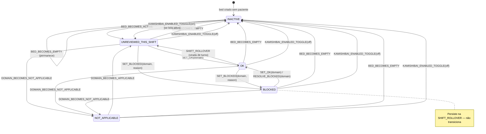

# LEAN\_STATE\_MACHINE\_HRHDS — BedSight

**Versão:** v1.0 | **Data:** 2026-02-28 | **Base:** LEAN\_CONTRACT\_HRHDS v1.0

---

## 1. Escopo

Este documento define a **máquina de estados canônica** para:

- Kamishibai por domínio (6 domínios fixos — `medical, nursing, physio, nutrition, psychology, social`)
- Kanban (4 categorias de previsão de alta)
- Huddle AM/PM (estado de cadência da unidade)

Distingue explicitamente: **leito ativo** vs **leito vazio**, **Sem cor** vs **N/A** vs **Inativo**.

---

## 2. Matriz de estados Kamishibai (por domínio)

> **5 estados lógicos.** Somente 2 são armazenados diretamente (`ok`, `blocked`). Os outros 3 são **derivados** em runtime a partir de condições do documento.

| Estado lógico | Nome canônico | Persiste entre turnos? | Dot na UI | Condições necessárias (em ordem de precedência) |
| -------------- | --------------- | ---------------------- | ---------- | ------------------------------------------------ |
| **INACTIVE** | Inativo | N/A | Sem dot — posição vazia/neutra | `patientAlias.trim() === ''` (leito vazio) **OU** `kamishibaiEnabled === false` |
| **NOT_APPLICABLE** | Não aplicável | Não se aplica | Sem dot — placeholder cinza leve (distinto de branco/vazio) | Leito ativo + domínio marcado como N/A (via `applicableDomains` — OD-2) |
| **UNREVIEWED\_THIS\_SHIFT** | Sem cor (não revisado) | Não — reseta a cada turno | Sem dot — posição em branco | Leito ativo + kamishibai habilitado + domínio aplicável + `reviewedShiftKey ≠ currentShiftKey` |
| **OK** | Verde | Não — expira na virada de turno | 🟢 Dot verde | Leito ativo + kamishibai habilitado + `status === 'ok'` + `reviewedShiftKey === currentShiftKey` |
| **BLOCKED** | Vermelho | **Sim** — persiste entre turnos | 🔴 Dot vermelho | Leito ativo + kamishibai habilitado + `status === 'blocked'` (independente de `reviewedShiftKey`) |

### 2.1 Estado armazenado vs estado visual

```text
Armazenado em Firestore:
  kamishibai.{domain}.status          → 'ok' | 'blocked'   (somente estes dois)
  kamishibai.{domain}.reviewedShiftKey → 'YYYY-MM-DD-AM' | 'YYYY-MM-DD-PM'
  kamishibai.{domain}.updatedAt       → Timestamp

Derivado em runtime (nunca armazenado):
  INACTIVE            → condição sobre bed + kamishibaiEnabled
  NOT_APPLICABLE      → condição sobre applicableDomains
  UNREVIEWED_THIS_SHIFT → status=ok mas reviewedShiftKey ≠ currentShiftKey
```

---

## 3. Regras de precedência (resolução de conflitos)

Aplicar na ordem abaixo — a **primeira condição verdadeira** vence:

```text
1. bed.patientAlias.trim() === ''           → INACTIVE  (leito vazio)
2. kamishibaiEnabled === false              → INACTIVE  (ferramenta desligada)
3. domain ∉ bed.applicableDomains          → NOT_APPLICABLE
4. kamishibai[domain].status === 'blocked' → BLOCKED
5. kamishibai[domain].reviewedShiftKey
       ≠ computeShiftKey(now)              → UNREVIEWED_THIS_SHIFT
6. kamishibai[domain].status === 'ok'
   AND reviewedShiftKey === currentShiftKey → OK (verde)
```

> **Nota:** BLOCKED não verifica `reviewedShiftKey` — bloqueios persistem entre turnos por definição do contrato (§4.5 do LEAN_CONTRACT_HRHDS).

---

## 4. Máquina de estados — transições do Kamishibai

### 4.1 Diagrama de estados (Mermaid)



### 4.2 Especificação de cada evento

---

#### `SET_OK(domain)`

| Item | Valor |
| ------ | ------- |
| **Disparado por** | Usuário no Editor (marca domínio como OK) |
| **Pré-condições** | Leito ativo, kamishibai habilitado, domínio aplicável |
| **Campos escritos** | `kamishibai.{domain}.status = 'ok'`, `reviewedShiftKey = computeShiftKey(now)`, `reviewedAt = now`, `updatedAt = now`, `updatedBy = actorRef` |
| **Estado visual resultante** | 🟢 **OK** (verde) |
| **Efeitos colaterais** | Aging de bloqueio cessa (se estava BLOCKED antes) — `blockedAt` é preservado para histórico |

---

#### `SET_BLOCKED(domain, reason?, note?)`

| Item | Valor |
| ------ | ------- |
| **Disparado por** | Usuário no Editor (declara impedimento) |
| **Pré-condições** | Leito ativo, kamishibai habilitado, domínio aplicável |
| **Campos escritos** | `kamishibai.{domain}.status = 'blocked'`, `blockedAt = now` (se não existia), `reason = reason \|\| ''`, `note = note \|\| ''`, `reviewedShiftKey = computeShiftKey(now)`, `updatedAt = now`, `updatedBy = actorRef` |
| **Estado visual resultante** | 🔴 **BLOCKED** (vermelho) |
| **Efeitos colaterais** | Aging começa a partir de `blockedAt`. `blockedAt` NÃO é sobrescrito se já existia (preservar data do bloqueio original). |

---

#### `RESOLVE_BLOCKED(domain)` (equivalente a `SET_OK`)

| Item | Valor |
| ------ | ------- |
| **Disparado por** | Usuário no Editor (resolve impedimento) |
| **Pré-condições** | `status === 'blocked'` |
| **Campos escritos** | `status = 'ok'`, `resolvedAt = now`, `reviewedShiftKey = computeShiftKey(now)`, `updatedAt = now`, `updatedBy = actorRef` |
| **Estado visual resultante** | 🟢 **OK** |
| **Efeitos colaterais** | `blockedAt` preservado para histórico. `resolvedAt` novo campo (v1). |

---

#### `SHIFT_ROLLOVER(AM→PM / PM→AM)`

| Item | Valor |
| ------ | ------- |
| **Disparado por** | Sistema — computed em runtime (comparação de `reviewedShiftKey` com `currentShiftKey`) |
| **Pré-condições** | Sempre |
| **Campos escritos** | **Nenhum** — rollover é uma mudança de interpretação visual, não de dados |
| **Estado visual resultante** | `OK` → **UNREVIEWED\_THIS\_SHIFT**; `BLOCKED` → **BLOCKED** (persiste) |
| **Efeitos colaterais** | `lastHuddleShiftKey` da unidade fica desatualizado — indicador "Huddle pendente" aparece na TV |

> **Implementação:** não há job/cron. A cada render da TV/Editor, o frontend computa `currentShiftKey` e compara com `reviewedShiftKey` do campo. Se diferente e `status=ok` → exibe sem cor.

---

#### `BED_BECOMES_EMPTY`

| Item | Valor |
| ------ | ------- |
| **Disparado por** | Usuário no Editor (remove `patientAlias`) ou soft reset |
| **Pré-condições** | Leito ativo |
| **Campos escritos** | `patientAlias = ''` (possivelmente reset dos campos de bed) |
| **Estado visual resultante** | **INACTIVE** em todos os 6 domínios |
| **Efeitos colaterais** | Leito sai de todos os KPIs do Mission Control |

---

#### `BED_BECOMES_ACTIVE`

| Item | Valor |
| ------ | ------- |
| **Disparado por** | Usuário no Editor (preenche `patientAlias`) |
| **Pré-condições** | Leito vazio |
| **Campos escritos** | `patientAlias = alias` |
| **Estado visual resultante** | Todos os domínios → **UNREVIEWED\_THIS\_SHIFT** (nenhum foi revisado ainda) |
| **Efeitos colaterais** | Leito entra nos KPIs de Mission Control |

---

#### `DOMAIN_BECOMES_NOT_APPLICABLE`

| Item | Valor |
| ------ | ------- |
| **Disparado por** | Usuário no Editor (desmarca domínio em `applicableDomains`) — OD-2 |
| **Campos escritos** | Remove domínio de `applicableDomains[]` |
| **Estado visual resultante** | **NOT\_APPLICABLE** (sem dot, placeholder neutro) |
| **Efeitos colaterais** | Domínio sai de contagem de impedimentos do Mission Control |

---

#### `DOMAIN_BECOMES_APPLICABLE`

| Item | Valor |
| ------ | ------- |
| **Disparado por** | Usuário no Editor (marca domínio em `applicableDomains`) |
| **Campos escritos** | Adiciona domínio a `applicableDomains[]` |
| **Estado visual resultante** | **UNREVIEWED\_THIS\_SHIFT** (domínio ainda não foi revisado neste turno) |

---

#### `KAMISHIBAI_ENABLED_TOGGLE(on/off)`

| Item | Valor |
| ------ | ------- |
| **Disparado por** | Admin no OpsScreen (liga/desliga `kamishibaiEnabled`) |
| **Campos escritos** | `settings/ops.kamishibaiEnabled = true \| false` |
| **Estado visual resultante** | `off` → todos dots **INACTIVE** (TV oculta semáforos); `on` → estados derivados normalmente |
| **Efeitos colaterais** | Mission Control oculta/exibe card de impedimentos Kamishibai. Dados Firestore NÃO são alterados. |

---

## 5. Matriz Kanban (Previsão de Alta)

| Valor (`expectedDischarge`) | Label | Cor badge | Classe CSS | Regra de exibição | Compat. legado |
| ---------------------------- | ------- | ----------- | ----------- | ------------------- | --------------- |
| `'24h'` | `< 24h` | 🟢 Verde | `state-success-bg` | Somente leito ativo | ✅ Mantido |
| `'2-3_days'` | `2–3 dias` | 🟡 Amarelo | `state-warning-bg` | Somente leito ativo | ✅ Mantido |
| `'>3_days'` | `> 3 dias` | 🔴 Vermelho | `state-danger-bg` | Somente leito ativo | ✅ Mantido |
| `'later'` | `Indefinida` | ⬜ Sem cor | `kanban-badge-indefinida` | Somente leito ativo (borda tracejada) | ✅ Mantido |
| *(leito vazio)* | — | Sem badge | — | Posição vazia no grid, sem badge | N/A |

> **Compatibilidade:** as 4 categorias são mantidas do v0. Nenhuma migração de valor necessária.
>
> **Distinção canônica:** badges do Kanban (verde/amarelo/vermelho = horizonte de alta) **NÃO têm o mesmo significado** que dots do Kamishibai (verde = OK de equipe; vermelho = bloqueio). São sistemas visuais independentes.

---

## 6. Matriz de estados do Huddle (nível de unidade)

| Estado | Condição | Indicador na TV |
| -------- | ---------- | ---------------- |
| **HUDDLE\_DONE** | `lastHuddleShiftKey === computeShiftKey(now)` | Sem indicação especial (normal) |
| **HUDDLE\_PENDING** | `lastHuddleShiftKey ≠ computeShiftKey(now)` ou campo ausente | Badge "Huddle pendente" (a implementar) |

> Huddle registrado no turno AM não conta para o turno PM e vice-versa.
